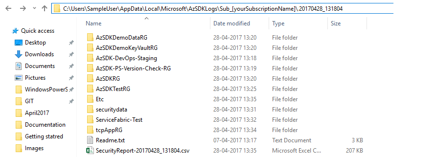

## Scan your Azure resources for security vulnerabilities
###### :clock10: 30 minutes to complete
The Secure Development components of the AzSDK enable a developer to build a cloud application with security baked in at every stage from design until integration and deployment through various artifacts, tools and automation.  
It includes Security Verification Tests (SVT) for all the prominent features in Azure (e.g., Web Apps, Storage, SQL DB, Key Vault, etc.). SVTs comprise of the cmdlets that perform a set of automated checks against Azure resources of those types and provide detailed report(in the form of CSV and Log file) on the healthiness status for the resources.

> Note: Ensure you already have the latest version of AzSDK installed on your machine. If not, please follow instruction [here.](../00a-Setup/Readme.md)  

**Step 1**: Run the below command by replacing with your Azure SubscriptionId  
```PowerShell
   Get-AzSDKAzureServicesSecurityStatus [-SubscriptionId] <String>
```
You can also narrow down your scan to a particular resource group or you can even make use of 'tags' parameter to scan only certain resources. More details can be found [here.](../02-Secure-Development/Secure_Development_userguide.md#how-do-i-check-for-specific-resource-groups-or-tagged-resources-only)  

You will start seeing output such as the following in the PowerShell console. Time required for execution will depend on the number of resources that you getting scanned.    

  

**So what's happening?** 

Basically, the AzSDK command is scanning all the Azure resources in the given subscription (e.g. in above case 64 various resources in the given subscription) using a set of security rules implemented in the PS cmdlet 'Get-AzSDKAzureServicesSecurityStatus'. 

As each rule scan is conducted, the command prints out information about the specific security check being performed. 

Once the execution is complete, it will open up the output folder for you. It has a single CSV file which provides the consolidated security report of all the resources that were evaluated. It also has a detailed LOG file for every resource that was evaluated. To make these logs more convenient to use, they are grouped under the separate folders as per the resource groups under which the resources themselved are organized in your subscription. 

  

We can now examine the CSV file to see the control summary. (It opens by default in XLS and you can use "Format as Table", "Hide Columns", "Filter" etc. to quickly look at controls that have "Failed" or ones that are marked "Verify" (in that they need manual verification).  

  

For controls that are marked 'Failed' or 'Verify', there is usually additional information present in the LOG file to help understand why a control was marked as 'Failed' (or what needs verification if it was marked as 'Verify'). For instance, below, it is telling me that dignostics settings are either disabled or they are not retaining data for minimum 365 days for my Key Vault resource.

  

> **Note:** Timestamps are used to disambiguate multiple invocations of the cmdlets.  

You have completed this getting started guide successfully. To get more details and understand in depth, please refer [here.](../02-Secure-Development/Secure_Development_userguide.md)
