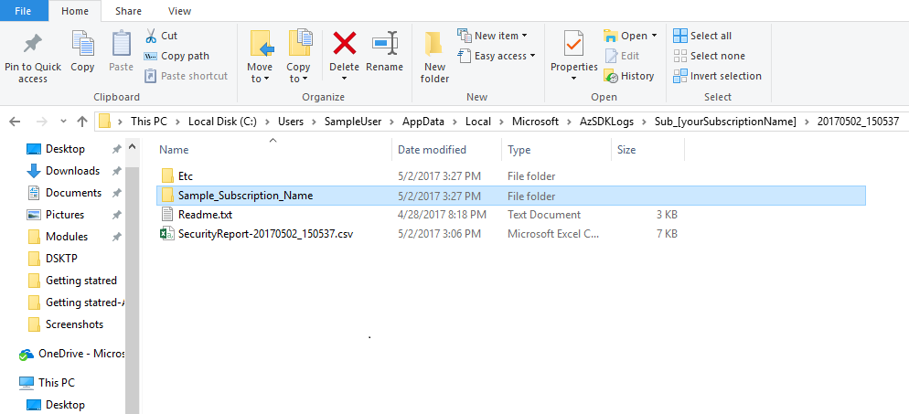
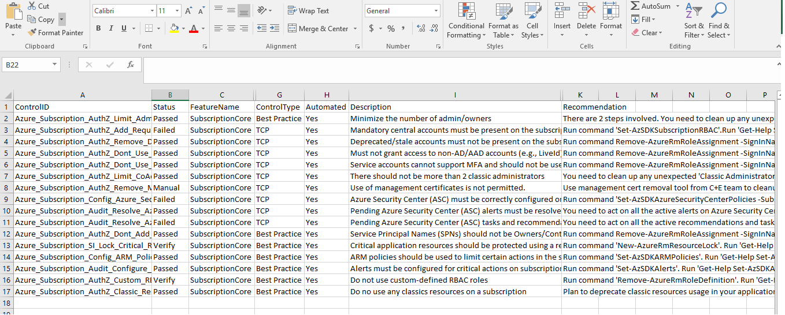

## Scan your Azure Subscription for security vulnerabilities
###### :clock10: 30 minutes to complete
The Subscription Security (SS) package with in AzSDK contains a set of scripts that examines a subscription and flags off security issues, misconfigurations or obsolete artifacts/settings which can put your subscription at higher risk.
This package adds-on to the exiting Azure capabilities like Security Center, IAM, etc. and extends it further to check for the presence for non-tenant accounts, SPN with higher priviliges, alerting configuration etc.

> Note: Ensure you already have the latest version of AzSDK installed on your machine. If not, please follow instruction [here.](../00a-Setup/Readme.md)

**Step 1**: Run the below command by replacing with your Azure SubscriptionId
```PowerShell  
Get-AzSDKSubscriptionSecurityStatus [-SubscriptionId] <String>
```  

You will start seeing output such as the following in the PowerShell console. You could see the realtime progress as it scans each security control on your subscription.

  

**Completed !!** You have successfully scanned your subscription for different security controls.

**So what's happening?** 

Basically, the AzSDK command is scanning the specified target Azure resource (in this case your subscription) using a set of security rules implemented in the PS cmdlet 'Get-AzSDKSubscriptionSecurityStatus'. 

As each rule scan is conducted, the command prints out information about the specific security check being performed. For instance, above, the last rule it has checked is if any deprecated/stale account is present in the subscription.  

Once the execution is complete, it will open up the output folder for you. 

   

As the rules are checked, in the background, it collects 
- summary information of the control pass/fail status in a CSV file and 
- detailed control evaluation log in a LOG file.   

We can now examine the CSV file to see the control summary. (It opens by default in XLS and you can use "Format as Table", "Hide Columns", "Filter" etc. to quickly look at controls that have "Failed" or ones that are marked "Verify" (in that they need manual verification).  

  

For controls that are marked 'Failed' or 'Verify', there is usually additional information present in the LOG file to help understand why a control was marked as 'Failed' (or what needs verification if it was marked as 'Verify'). For instance, below, it is telling me that there were more number of admins/owners were found in my subscription than the approved limit. (Just as FYI, all such policy/config info is present in JSON-based rule files that each command uses in the background. These files are downloaded 'live' from a central location for command execution. A copy of the same rule files are also present in the PS folder corresponding to each AzSDK module…which helps if, for some reason, the central server is not available.)  

  

> **Note**: Timestamps are used to disambiguate multiple invocations of the cmdlets.  
 
You have completed this getting started guide successfully. To get more details and understand in depth, please refer [here](../01-Subscription-Security-(SS)/Readme.md).
