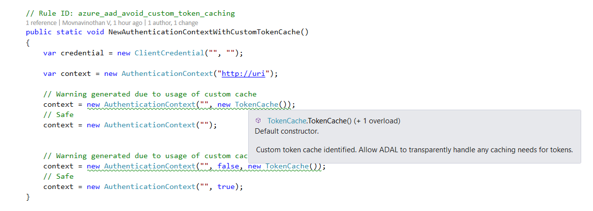
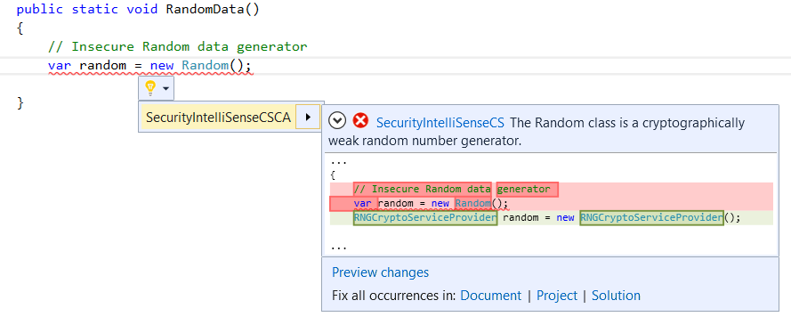
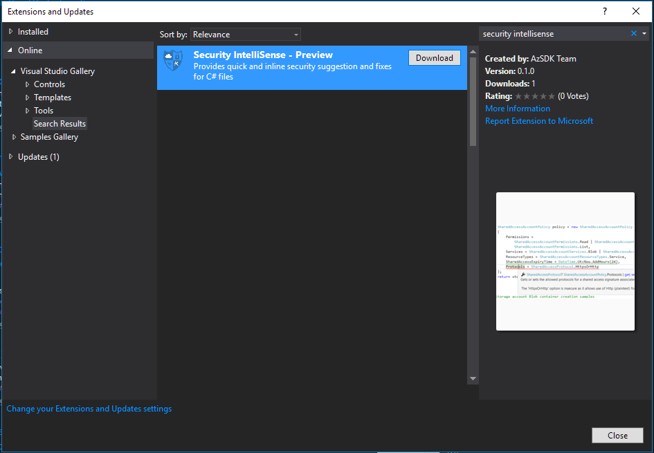
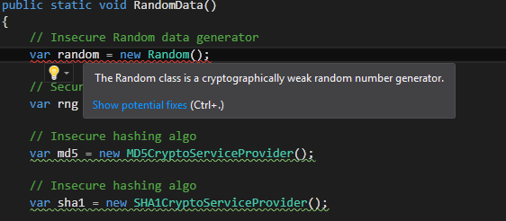
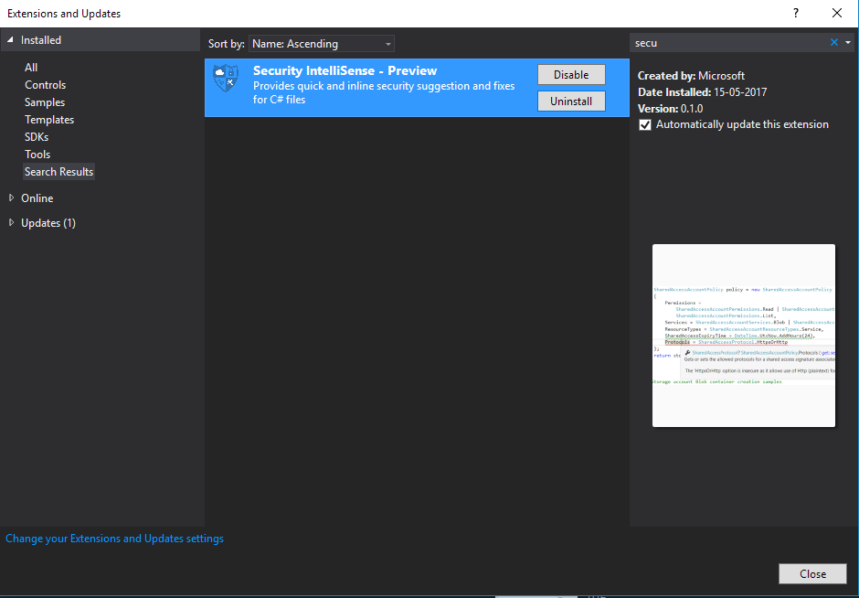

# Security IntelliSense (Dev-SecIntel)

### Contents
#### [Basics](Security_IntelliSense_userguide.md#basics-1)
- [What is Security IntelliSense?](Security_IntelliSense_userguide.md#what-is-security-intellisense)
- [How do I enable Security IntelliSense on my dev box?](Security_IntelliSense_userguide.md#how-do-i-enable-security-intellisense-on-my-dev-box)
- [Is there a sample I can use to see how it works?](Security_IntelliSense_userguide.md#is-there-a-sample-i-can-use-to-see-how-it-works)
#### [Rules](Security_IntelliSense_userguide.md#rules-1)
- [What 'secure coding' rules are currently covered?](Security_IntelliSense_userguide.md#what-secure-coding-rules-are-currently-covered)
- [How are the rules updated? Do I need to refresh the plugin periodically?](Security_IntelliSense_userguide.md#how-are-the-rules-updated-do-i-need-to-refresh-the-plugin-periodically)
- [Can I add my own rules over and above the default set?](Security_IntelliSense_userguide.md#can-i-add-my-own-rules-over-and-above-the-default-set)
- [Can I 'mask' a particular rule or rules?](Security_IntelliSense_userguide.md#can-i-mask-a-particular-rule-or-rules)
- [Can I change the 'recommended' code for a rule?](Security_IntelliSense_userguide.md#can-i-change-the-recommended-code-for-a-rule-eg-cbc-v-gcm-mode)
#### [Actions](Security_IntelliSense_userguide.md#actions-1)
- [What should I do to remove the extension?](Security_IntelliSense_userguide.md#what-should-i-do-to-remove-the-extension)
- [What default compiler actions are configured?](Security_IntelliSense_userguide.md#what-default-compiler-actions-are-configured)
- [Can I customize actions for my dev box / team? (E.g. change Error -> Warnings etc.)](Security_IntelliSense_userguide.md#can-i-customize-actions-for-my-dev-box--team-eg-change-error---warnings-etc)
	
--------------------------------------------------------------
> Note: Security IntelliSense extension works on Visual Studio 2015 Update 3 or later


[Back to top…](Security_IntelliSense_userguide.md#contents)

### Basics:

### What is Security IntelliSense?
Security IntelliSense augments standard Visual Studio IntelliSense feature with secure coding knowledge. This makes it possible to get 'inline' assistance for fixing potential security issues while writing code. Code that is vulnerable or not policy compliant is flagged with red or green squiggles based on the level of severity.

In the current drop, we have support for the following features:
- About 80 rules that cover a variety of scenarios such as: 
   - various Azure-API related secure coding situations.
   - ADAL-based authentication 
   - Common Crypto errors
   - Classic App Sec and Web App Sec
- Rule are auto-updated without needing to reinstall the plug-in. The plug-in periodically checks if new rules have been published to a central rule store and updates its local rule set based on that.

The screenshots below show the core functionality at work:
- Error and warning indications for incorrect and possibly vulnerable code:
	(E.g., use of custom token cache in ADAL scenario)  



- Suggestions for corrections/compliant coding practices:
	(E.g., Instead of Random, the RNGCryptoServiceProvider class should be used in a crypto context.)  
  

[Back to top…](Security_IntelliSense_userguide.md#contents)  

### How do I enable Security IntelliSense on my dev box?
- Open Visual Studio 2015
- Go to **Tools** -> **Extensions and Updates** -> In the left sidebar select **Online** -> **Visual Studio Gallery** and search for **Security IntelliSense** in the right sidebar



- Select Security IntelliSense item and click **Download**
- After download completes, in the pop-up click **Install**
- After installation completes, **restart Visual Studio**

[Back to top…](Security_IntelliSense_userguide.md#contents)
### Is there a sample I can use to see how it works?
- We hosted a sample project at GitHub, run below command to clone the repo. If you don't have git setup in your machine, please visit https://git-scm.com/downloads to download
	
``` 
    git clone https://github.com/azsdk/azsdk-secintel-samples
```
	
- After cloning the repo, navigate to **azsdk-secintel-samples** -> **SecIntelSample** and open the **SecIntelSample.sln** in Visual Studio (after completing the Security IntelliSense extension installation per steps from above).
- Do a "Build Sample" once so that Nuget packages needed get downloaded.
- Build the solution (this will fetch any requisite Nuget packages)
- Go to View->Solution Explorer and then open one of demo files such as "CryptoSample.cs" in the VS editor. 
   - You should see SecIntel in action -- i.e., code that is in violation of the rules in use for the SecIntel VSIX plugin will appear as red-squigglies (errors) and green-squigglies (warnings).  
   

- Note: In the currently implemented behavior of the extension, 'errors' don’t actually fail the build. We will change this behavior in an upcoming sprint. After that anything that is considered an 'error' will start failing the build. This will be a useful feature when integrating with CICD pipelines.

[Back to top…](Security_IntelliSense_userguide.md#contents)

### Rules:

### What 'secure coding' rules are currently covered?

The following are some of the rules we support in current build (some are 'warnings' others 'error') -
- Azure:
   - Use of relays without client authentication
   - Creation of shared access policy without enforcing HTTPS explicitly
   - Creation of shared access policy with an overly long expiry period
   -Creation of container with access set to 'Public'
   - Creation of a blob with access set to 'Public'
- ADAL/Graph usage:
   - Use of simple member access as opposed to transitive search
   - Explicit handling of access and refresh tokens as opposed to letting ADAL manage them transparently
   - Disabling 'Authority' validation when fetching a token via ADAL
   - Use of custom mechanisms to cache the tokens (should let ADAL handle them transparently)
- Crypto:
   - Use of Random instead of RNGCryptoServiceProvider class
   - Use of MD5 for hashing instead of SHA256CryptoServiceProvider
   - Use of SHA1 for hashing instead of SHA256CryptoServiceProvider
   - Use of RijndaelManaged instead of AesCryptoServiceProvider
   - Use of key sizes that are considered inadequate
   - Use of X509Certificate2 class (that might lead to a SHA1 based HMAC as opposed to a SHA256-based one).

For a complete list of Security IntelliSense rules please go [here](Security_IntelliSense_rules_list.md)
	
[Back to top…](Security_IntelliSense_userguide.md#contents)
### How are the rules updated? Do I need to refresh the plugin periodically?
- Rule are auto-updated without the need to reinstall the plugin. Currently we have defined 5 different rule templates upon which individual rules are based. We have the ability to deploy new rules that use the existing templates silently in the background. 
- Once in a while we might add entirely new 'rule templates'. When that happens, a new version of the extension will need to be downloaded. When that happens will include a notification of the same in our release announcements.

[Back to top…](Security_IntelliSense_userguide.md#contents)
### Can I add my own rules over and above the default set?
- This will be included in the next month. It is a natural extension of the current behavior. We will merely need to include support for a locally managed rules file which has rules that adhere to the supported rule templates.

[Back to top…](Security_IntelliSense_userguide.md#contents)

### Can I 'mask' a particular rule or rules?
- This is in our backlog. We will add it in a future sprint.

[Back to top…](Security_IntelliSense_userguide.md#contents)
### Can I change the 'recommended' code for a rule? (e.g., CBC v. GCM mode)
- This is in our backlog. We will add it in a future sprint.

[Back to top…](Security_IntelliSense_userguide.md#contents)

### Actions:
### What should I do to remove the extension?
-  Go to "Tools" -> "Extensions and Updates" menu option in Visual Studio and search for "Security".
   - If you have the extension installed, you will see a screen such as below with options to "Disable" or "Uninstall" the extension.
- Click "Uninstall" and restart Visual Studio.
  

[Back to top…](Security_IntelliSense_userguide.md#contents)
### What default compiler actions are configured?
- Most of the rules configured are of severity "Warning"

[Back to top…](Security_IntelliSense_userguide.md#contents)
### Can I customize actions for my dev box / team? (E.g. change Error -> Warnings etc.)
- Currently we do not support it. We have it in our pipeline to support it.  

[Back to top…](Security_IntelliSense_userguide.md#contents)
