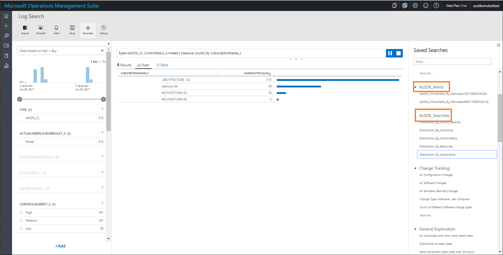
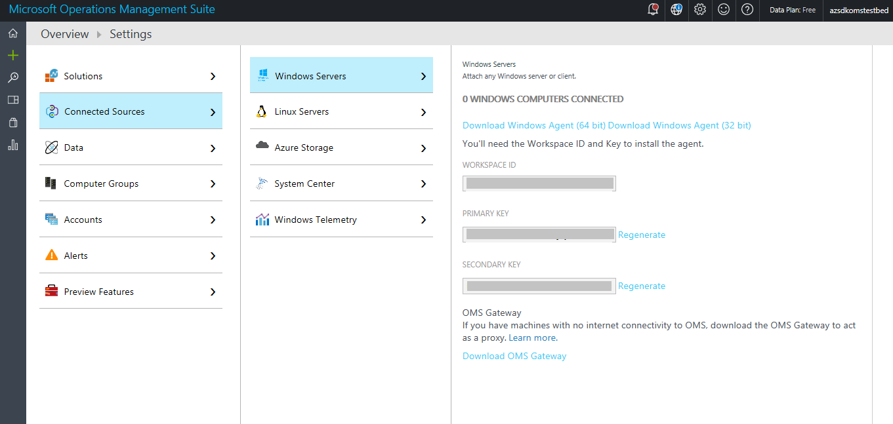
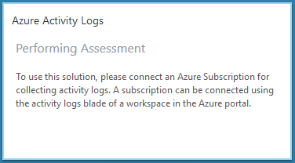
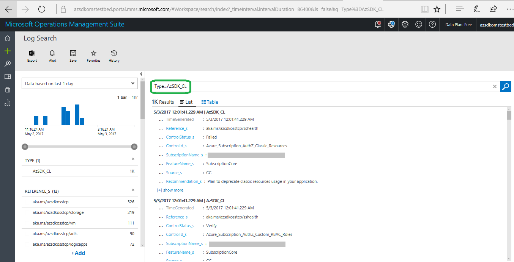
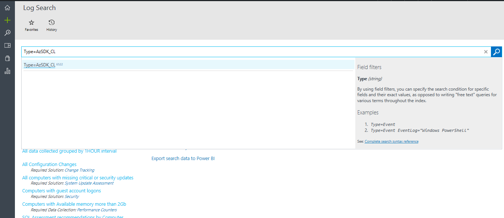
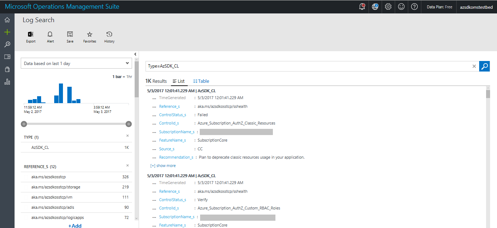
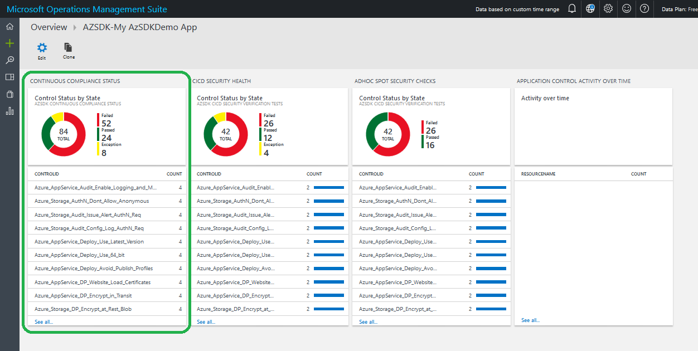

# OMS Solution for AzSDK
 ### Contents
- [Overview](Alert_Monitoring_userguide.md#overview)
- [Routing AzSDK events to OMS](Alert_Monitoring_userguide.md#routing-azsdk-events-to-oms)
- [Components of the AzSDK OMS Solution](Alert_Monitoring_userguide.md#components-of-the-azsdk-oms-solution)
- [Setting up the AzSDK OMS Solution (Step by Step)](Alert_Monitoring_userguide.md#setting-up-the-azsdk-oms-solution-step-by-step)
- [Next Steps](Alert_Monitoring_userguide.md#next-steps)

--------------------------
### Overview 
The Alerting & Monitoring area of AzSDK offers features empowers dev ops teams with the following capabilities:
- a single pane of glass view of cloud security across dev ops stages
- visibility to control status for their Azure subscription and critical enterprise/application resources
- pre-configured search queries and alerts to facilitate action on security drift

Out of box, this can be accomplished via Operations Management Suite (OMS) by leveraging the OMS
Solution in the AzSDK.

However, if a team would rather leverage a different system for their log analytics, the AzSDK also
supports routing events to other downstream systems through connectors for Event Hubs and Webhooks.
[Back to top…](Alert_Monitoring_userguide.md#contents)

### Routing AzSDK events to OMS
Note that the Security Verification Tests (SVTs) from AzSDK can be run in 3 stages:
1. Development (referred to as "SDL")
2. Build/Deployment ("CICD")
3. Continuous Assurance ("CA")

The results of control evaluation generated by running AzSDK SVTs in all of these stages can be 
(independently) sent to OMS. Depending on the stage the way to wire up AzSDK with OMS is different. 

1. In the development ("SDL") stage, the following command can be used to set the OMS workspace that will collect events generated via various AzSDK-scripts/SVTs etc. in a subscription:

```PowerShell
 Set-AzSDKOMSSettings -OMSWorkspaceID <OMSWorkspaceID> -OMSSharedKey <OMSSharedKey>
```

2. In the CICD stage, the OMS settings are specified in the input parameters for the [AzSDK SVTs build/release extension](../03-Security-In-CICD/Security_In_CICD_userguide.md).
3. For the CA runbooks, the OMS workspace info is specified in the input parameters of the [Continuous Assurance setup script](../04-Continous-Assurance/Continuous_Assurance_userguide.md).  

Events sent from these (different devops) stages of one or more applications get aggregated 
in the OMS workspace alongside events from the various out-of-box solution packs available in 
the OMS gallery. The OMS solution for AzSDK also leverages the out-of-box solution packs 
(such as Log Analytics, Alerts, etc.) together with native AzSDK custom log events to provide 
an overall view of security across the different DevOps stages for these applications. The picture below shows a conceptual view of this.  

> Note AzSDK custom log events show up as Type=AzSDK_CL in the OMS workspace.


[Back to top…](Alert_Monitoring_userguide.md#contents)

### Components of the AzSDK OMS Solution
The AzSDK OMS Solution is basically an ARM template that a user can deploy on the subscription 
that hosts the OMS workspace where events are to be routed. 
Based on a few key inputs provided by the end user, the solution creates a template deployment 
which builds and sets up all the necessary artifacts required for security state visibility and 
monitoring.

The out of box security dashboard generated by the OMS solution includes:
1. Summary view of critical tasks that require immediate attention
2. Outcomes of the most recent 'Continuous Assurance' scans
3. Ready to use log search queries for security drift conditions
4. Alerts for situations that require immediate attention

**A- View of tiles in the main dashboard**


**B- AzSDK Searches and Alerts**
	


**C- Application Security View**


[Back to top…](Alert_Monitoring_userguide.md#contents)

### Setting up the AzSDK OMS Solution (Step by Step)
This section will walk you through the step-by-step experience of setting up the AzSDK OMS solution.

The workflow involves two sets of steps - one set to be run by the monitoring team that owns 
the OMS workspace and the other set to be run by the application team (for applications which 
are to be monitored via a common OMS dashboard).
We will refer to the central BU team as the "**Ops team**" and the application team as 
the "**App team**" below.

> **Note**: In a single/small team scenario, both of these personas could be the same person/group and 
> the OMS subscription could be the same as the application subscription. These steps should still apply.

The general model this assumes is one where there are (1) multiple subscriptions covering a 
portfolio of applications for a business unit and (2) a central subscription that hosts the OMS 
workspace for that business unit. We call the former subscriptions the 'app subscriptions' and 
the latter the 'OMS subscription'.

At a high level, we will accomplish the following in a step-by-step manner:
- Create an OMS workspace in the central subscription (if there isn't one already)
- Configure one or more app subscriptions to send AzSDK/other events to this OMS workspace
- Deploy the AzSDK OMS Solution in the OMS subscription
- Start leveraging the solution to view security status/alerts/etc.

The core setup command for the OMS solution is covered in Step-6. Steps 1 through 5 are all to get you
setup with the pre-requisites or some requirements which are relevant in advanced scenarios.

<!-- TODO: reorg later so that the core setup-OMS step comes up -->

**Step-1 (Ops team):** Create a new OMS workspace.

Go to https://mms.microsoft.com and follow the simple steps to create a new OMS workspace.
	


**Note:** If you already have an OMS workspace that is used for other monitoring activities, 
then, ideally, the same workspace should be used for setting up the AzSDK OMS solution as well. 
The idea is that the security views appear alongside other views on the 'general' operations dashboard and 
not in a standalone one.


**Step-2 (Ops Team):** Associate with an Azure Subscription. 

This should be the central subscription that is to host the OMS workspace.

  


**Step-3 (Ops Team):** Capture the WorkspaceID and PrimaryKey for the workspace by clicking on 
"Settings" for the OMS workspace and navigating to "Connected Sources -> Windows Servers".




As an aside, after concluding setup for the OMS workspace, you will also get an email for email 
address confirmation such as the one below:


**Step-3x: Optional** (Ops Team) Add Alert Management Solution Pack from OMS Solution Gallery (choose default installation) in the OMS subscription.


	
**Step-3y: Optional** (Ops Team) Add Activity Log Analytics Solution Pack from the gallery (see pic above) 
and configure it (steps below). After you install the Activity Log Solution Pack from the gallery, 
it's dashboard tile directs you to do connect a log source as shown below:
	


1. This connection is setup in the OMS subscription by going into the Log Analytics feature and 
clicking on "Azure Activity Log" in the Workspace Data Sources list as below:

  

2. From the OMS Subscription, one can view all subscriptions that the Ops team person (current user) 
has at least "Reader" level access as options for 'Connecting' to Log Analytics pack. It means that App team 
subscriptions will show here as an option only if at least "Reader" access is granted to the 
current OMS user. (This is an OMS product requirement.)  

Choose the subscription(s) corresponding to the apps that are being monitored and click 'Connect'.
      

	
Note: The above steps have to be done from the **OMS** subscription.

At this point, the app subscription is setup to pipe it's Azure Activity Log events to the OMS workspace. 

In the next 2 steps we will configure AzSDK to send data to the OMS workspace from a PowerShell session. 
This is just so that we can verify that events generated AzSDK are getting routed to the OMS workspace
correctly. 

**Step-4 (App Team):** Connect the application subscription to the above OMS workspace for sending AzSDK events.
Run the below code in a PS session after logging in to Azure (this assumes that you have the latest AzSDK installed).
```PowerShell
 $wsID = 'oms_workspace_id_here'
 $shrKey = 'workspace_sharedKey_here'
	
 Set-AzSDKOMSSettings -OMSWorkspaceID $wsID -OMSSharedKey $shrKey
```
After doing so, AzSDK cmdlets, SVTs, etc. run on that user's machine will start sending events (outcomes of 
security scans) into the OMS repository represented by the workspaceID above.


**Step-5 (App Team):** Validate that AzSDK events are reaching the configured OMS workspace.

Run a few AzSDK cmdlets to generate events for the OMS repo. 
For example, you can run one or both of the following:

```PowerShell
 Get-AzSDKSubscriptionSecurityStatus -SubscriptionId $subID 
 Get-AzSDKAzureServicesSecurityStatus -SubscriptionId $subID -ResourceGroupNames 'app_rg_name'
```

After the above scans finish, if we go into OMS Log Search and search for 'AzSDK_CL', it should show 
'AzSDK custom log' events similar to the below ("_CL" stands for "custom log"):
	



**Step-6 (Ops Team): Deploy the AzSDK OMS Solution**

Use Set-AzureRmContext to choose the subscription corresponding to the OMS workspace and run the command below 
to get the details about your OMS workspace:

```PowerShell
 Get-AzureRmOperationalInsightsWorkspace 
```

As shown below, this outputs the OMS workspaces from the OMS subscription:


Run the below PS lines after replacing the various '<xyz>' with
(a) appropriate values for the OMS workspace to be used
(b) application subscription and resource groups and
(c) security POC for alert emails

See comments in the code and the table further below for a complete listing of the parameters and their purpose.

```PowerShell
    $omsSubscriptionId ='<omsSubId>'
    $omsResourceGroupName ='<omsResourceGroupName>'
    $OMSWorkspaceName ='<omsWsName>'

    $applicationName ='<appName>'            #This will be used to name the view in OMS
    $applicationSubscriptionId ='<appSubId>'           #This is the app subscription
    $applicationResourceGroups ='<appResourceGroups>'  #These are the RGs that make up the app

    $securityPointOfContactEmails = '<semicolon separated email list>'  #AzSDK alerts from OMS will come here

    Install-AzSDKOMSSolution -OMSSubscriptionId $omsSubscriptionId -OMSResourceGroup $omsResourceGroupName -OMSWorkspaceName $OMSWorkspaceName `
                         -ApplicationName $applicationName -ApplicationSubscriptionId $applicationSubscriptionId -ApplicationResourceGroups $applicationResourceGroups `
                         -SecurityContactEmails $securityPointOfContactEmails 
```

|ParameterName|Comments|
| ----- | ---- | 
|OMSSubscriptionId|Id of the subscription where the OMS workspace is hosted|
|OMSResourceGroup|Name of the resource group where the OMS workspace is hosted|
|OMSWorkspaceName|Name of the OMS workspace name which will be used for monitoring|
|ApplicationSubscriptionId|Id of the subscription which hosts the application|
|ApplicationResourceGroups|Comma separated values of resource groups which hold the application resources|
|ApplicationName|Name of the application (used to name views/queries etc. on the OMS side)|
|SecurityContactEmails|Security point of contacts who will be notified when alerts fire|
|OMSInstallationOption|(Optional) "All" (default) => install all the features of OMS pack, "Queries"=> installs AzSDK sample queries, "SampleView"=> install sample AzSDK security view, "Alerts"=> configures OMS workspace with alerts for ciritcal security failures|

A resource group name such as 'mms-xxx' is used by the default OMS setup process (where 'xxx' can 
be 'eus' or 'sea' etc. based on the region). If you specified a custom resource group name when creating 
the OMS workspace, then remember to use *that* name above. 
You can run **Get-AzureRmOperationalInsightsWorkspace** to see the correct value to use for the respective OMS workspace.)

The installation command will display output like the below:
	

      
Under the covers, the installation script does the following:
1. Adds an AzSDK-xxx view to the OMS workspace (including a tile for the main OMS dashboard)
2. Adds multiple "Saved Searches" for common search queries, 
3. Configures security-related alerts inside the OMS workspace, 
4. Install various schedules (for the above alerts)

At this point, the application's subscription is setup for AzSDK OMS monitoring. 

In the next step, we will look at these artifacts and verify that everything is setup correctly.


**Step-7 (Ops Team):** Viewing the various artifacts in the AzSDK OMS Solution Pack

**7-(a)** Viewing the events that have come across from the app sub.
Click on the 'magnifier' icon in the taskbar on the left to open the "Log Search" page.
Enter "Type=AzSDK_CL" in the query field.
	
 

You should see the data from the AzSDK cmdlet that were run by the app team (to generate some events in Step-5).


	
**7(b)** AzSDK Solution View
The solution view contains multiple blades representing alerts, various types of security activity, security trends, etc.
	


The above example is just the out-of-box view created by the AzSDK OMS Solution. 
You can setup/configure various other views based on your monitoring needs.
Below are other such sample views, which provide visibility of Azure security controls across devops stages.

At this point, we can confirm that the ad hoc security scan we ran in Steps 4, 5 above generated data for the application security control status by looking at the view (by clicking the tile above).


<!-- #TODO# Rework the story for build/CICD health. --> 
If you also have CICD integration setup, you can trigger a new deployment and also start seeing the AzSDK control evaluation results from CICD in the OMS workspace (as shown below):


Lastly, if you also setup continuous assurance (AzSDK CC runbooks), you will also see activity in the first blade as shown below:


	
[Back to top…](Alert_Monitoring_userguide.md#contents)

### Next Steps
Assuming that you have setup the OMS solution and, also, configured your developer machines (SDL stage), your build
environment (CICD stage) and your operational environment (CA) with the appropriate OMS settings, you are 
all set to monitor and act on security issues/drift for your cloud subscription and (application) resources.

Apart from regularly using the tiles and the views to get a snapshot view of security, make sure you also 
monitor the inbox corresponding to the SecurityContactEmails and resolving any alerts that may come through. 

Additionally, you could also do one or more of the following:
- setup more applications to be monitored similarly (by repeating the 'Deploy the AzSDK OMS Solution' 
step above for the respective applications)
- modify and customize the queries and alerts to suit additional needs for your application (for instance, your 
scenario may involve a storage blob that is so critical that you want to be alerted even if a medium severity
control fails for it in *any* stage of the devops loop.)
<!-- #TODO# - Configure the 'auto-correct' runbook for one or more critical resources -->

<!-- #TODO# - fix the 'Montoring' name... 'Alerting_and_Monitoring_userguide' -->
[Back to top…](Alert_Monitoring_userguide.md#contents)

