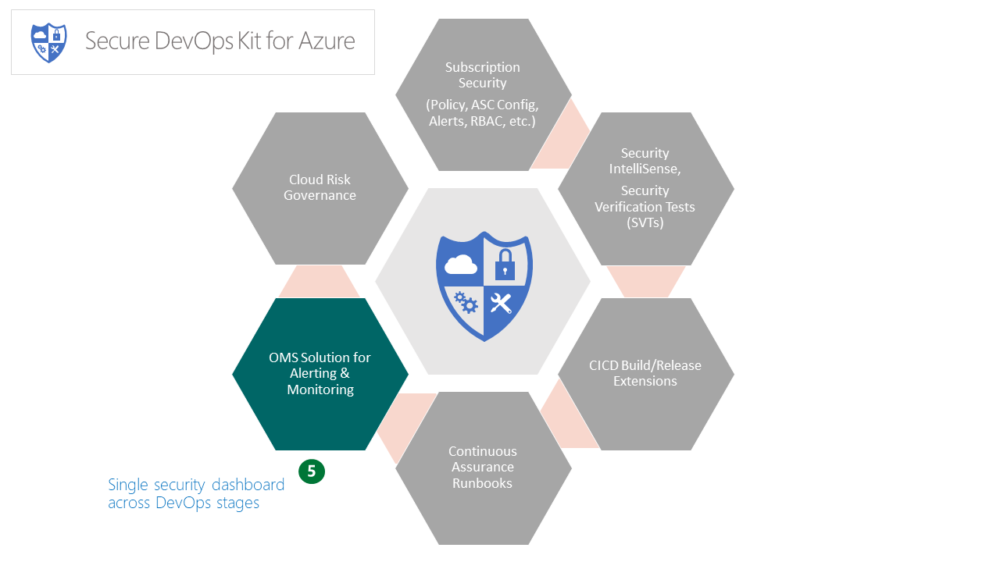
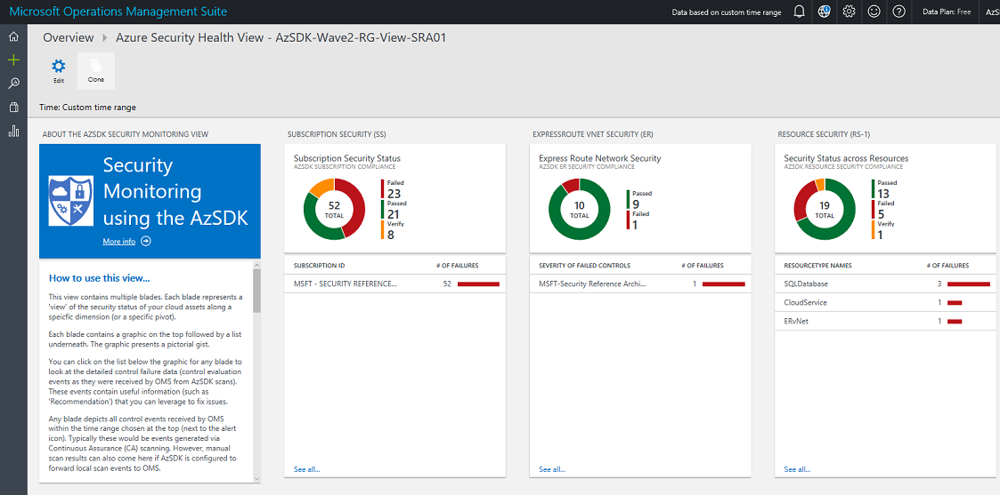
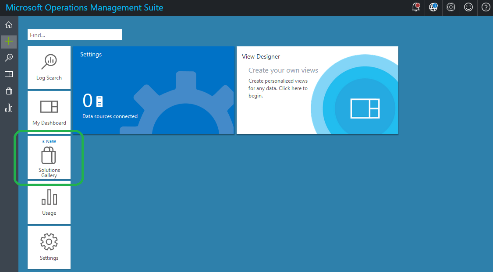
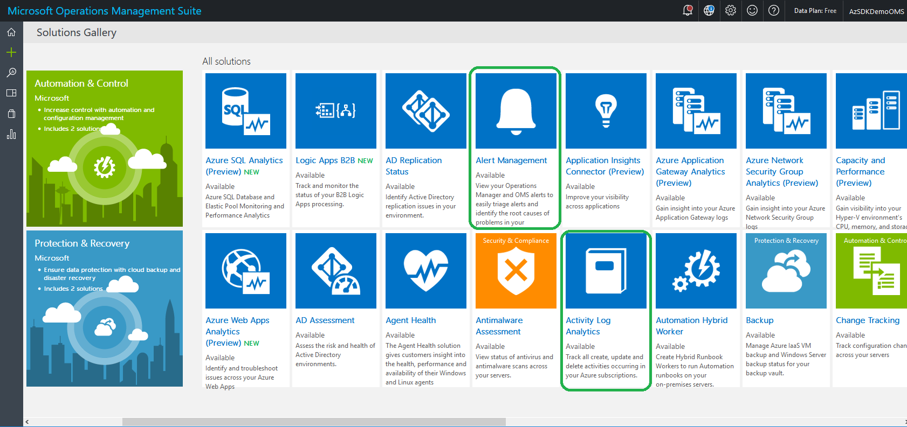
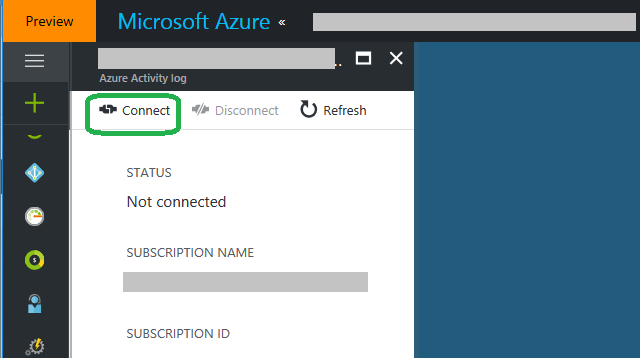

# Alerting & Monitoring



## OMS Solution for AzSDK
 ### Contents
- [Overview](Readme.md#overview)
- [Components of the AzSDK OMS Solution](Readme.md#components-of-the-azsdk-oms-solution)
- [Setting up the AzSDK OMS Solution (Step by Step)](Readme.md#setting-up-the-azsdk-oms-solution-step-by-step)
- [Next Steps](Readme.md#next-steps)
- [Appendix](Readme.md#Appendix)
  - [Creating an OMS workspace](Readme.md#[A]-creating-an-oms-workspace)
  - [Testing OMS connectivity](Readme.md#[B]-testing-oms-connectivity)
  - [Routing AzSDK events to OMS](Readme.md#[C]-routing-azsdk-events-to-oms)
  - [Leveraging other OMS Solutions from the Solutions Gallery](Readme.md#[D]-leveraging-other-oms-solutions-from-the-solutions-gallery)

--------------------------
### Overview: 
The Alerting & Monitoring features of AzSDK empower dev ops teams with the following capabilities:
- a single pane of glass view of cloud security across dev ops stages
- visibility to control status for their Azure subscription and critical enterprise/application resources
- pre-configured search queries for creating alerts to facilitate action on security drift

Out of the box, these capabilities can be leveraged via the Operations Management Suite (OMS) solution in AzSDK.

However, a dev ops team can equally easily leverage a different system for log analytics (e.g., Splunk) and view the AzSDK control evaluation events
in the alternate system. This can be accomplished by using via connectors for Event Hubs or Webhooks in the AzSDK.
  
[Back to top…](Readme.md#contents)


### Components of the AzSDK OMS Solution
The AzSDK OMS Solution is deployed to an OMS workspace that is used by the dev ops team for monitoring and 
generates a dashboard for security monitoring and alerting based on AzSDK control evaluation events.

The out of box security dashboard generated by the AzSDK OMS solution includes:
1. A summary tile for the main OMS dashboard (home view)
2. A detailed view comprised of multiple blades displaying security control status for your: 
   a) subscription, 
   b) express route networks and 
   c) other cloud resources (shown with various pivots)
3. Ready to use log search queries for security drift conditions

  

[Back to top…](Readme.md#contents)

### Setting up the AzSDK OMS Solution (Step by Step)
This section will walk you through the step-by-step experience of setting up the AzSDK OMS solution.

Note that for the OMS solution to display anything, you have to configure AzSDK in SDL or CICD or
CA mode to send events to the target OMS workspace as mentioned in the "Routing Events to OMS..." section above.

If you do not have an OMS workspace yet, see [Appendix](Readme.md#APPENDIX) to create one.

The rest of this section assumes that:
a) you have an OMS worskpace**
b) you have setup AzSDK to send events to that workspace (from one or more of SDL, CICD, CA stages)
c) some AzSDK scans have run in respective stages and events are already present in the OMS workspace

If you need help for any of the above, see the respective section in the [Appendix](Readme.md#APPENDIX) at the bottom.

** The OMS product team has recently made several improvements to the underlying store and have also adopted
a new query language. This write-up assumes that you are using the new/updated OMS workspace and
the new query language. If you have not migrated yet, we will also provide the corresponding old
language queries. (All images will show queries using the new language though!)

The AzSDK OMS setup involves two sets of steps - one set to be run by the monitoring team that owns 
the OMS workspace and the other set to be run by the application team (for applications which 
are to be monitored via a common OMS dashboard). 
We will refer to the monitoring team as the "**Ops team**" and the application team as 
the "**App team**" below. 

The general model assumed is one where there are (1) multiple subscriptions covering a 
portfolio of applications for a business unit and (2) a central subscription that hosts the OMS 
workspace for that business unit. We call the former subscriptions the 'app subscriptions' and 
the latter the 'OMS subscription'.

> **Note**: This is not to suggest a hard separation of roles between the actual individuals
involved. Indeed, most dev ops teams will have dev rotating to support ops and vice versa.)


**Step-1 (Ops Team): Deploy the AzSDK OMS Solution**

**[1-a]** Use Set-AzureRmContext to choose the subscription corresponding to the OMS workspace and run the command below 
to get the details about your OMS workspace:

```PowerShell
 Set-AzureRmContext -SubscriptionId '<subscriptionId here>'   #switch to the OMS subscription
 Get-AzureRmOperationalInsightsWorkspace #get info about the OMS workspace (we'll need that below)
```

This outputs the OMS workspaces from the OMS subscription as shown below:


**[1-b]** Obtain the workspaceId and sharedKey for the OMS workspace you'd like to use for monitoring. 
Click on "Settings" (gear wheel on the top band) for the OMS workspace and navigate to 
"Connected Sources -> Windows Servers" as shown in the image below:


**[1-c]**
Run the below commands in PS after replacing the various '<>' with
  (a) respective values for the OMS workspace to be used
  and (b) a unique name to identify the view with in the OMS home dashboard.

```PowerShell
    $omsSubId ='<oms subscription id>'   #subscription hosting the OMS workspace
    $omsWSId ='<oms workspace id>'
    $omsRGName ='<oms resource group name>'     #RG where the OMS workspace is hosted (See 1-a)
    $omsViewName = '<a unique name for your monitoring view>'     #E.g., MyApp-View-1


    #This command will deploy the AzSDK view in the OMS workspace. Happy monitoring!  
    Install-AzSDKOMSSolution -OMSSubscriptionId $omsSubId `
                    -OMSResourceGroup $omsRGName `
                    -OMSWorkspaceId $omsWSId `
                    -UniqueName $omsViewName
```

The table below explains the different parameters used by Install-AzSDKOMSSolution cmdlet:

|ParameterName|Comments|
| ----- | ---- | 
|OMSSubscriptionId|Id of the subscription where the OMS workspace is hosted|
|OMSResourceGroup|Name of the resource group where the OMS workspace is hosted|
|OMSWorkspaceId|Workspace ID of the OMS workspace name which will be used for monitoring|
|ViewName|Name of the AzSDK OMS view (unique per OMS workspace)|

> Note: A resource group name such as 'mms-xxx' is used by default by the OMS setup process (where 'xxx' can 
be 'eus' or 'sea' etc. based on the region). If you specified a custom resource group name when creating 
the OMS workspace, then remember to use *that* name in the install command above. 
If you forgot the custom resource group name you used, you can always use 
<code>Get-AzureRmOperationalInsightsWorkspace</code> to see the correct value to use for 
the respective OMS workspace.

The installation command will display output like the below:


      
At this point, assuming that AzSDK events were already being sent to the OMS workspace, you should start
seeing a tile such as the one below:


**Step-2 (Ops Team): Using the OMS view for monitoring**

**2 (a)** Viewing raw events from AzSDK (sanity check)

Click on the 'magnifier' icon in the taskbar on the left to open the "Log Search" page.

Enter "AzSDK_CL" in the query field. (Old query: "Type=AzSDK_CL")


You should see data about AzSDK events as query results. (Again, this assumes that by now AzSDK 
control scan results are being sent to this workspace. See Section-B in Appendix further below for
how that is done.)
 

If you are certain that events are being sent to the OMS but you are seeing blank views/no query results, 
you may need to extend the duration applicable to the queries. (This can be done using the drop-down to 
the left of the bell icon in the topmost band in the dashboard.)


	

**2 (b)** Using the AzSDK Solution
The solution view contains multiple blades representing alerts, various types of security activity, 
security trends, etc. This view shows up when you click on the view tile and looks like the picture
below:


The very first (Summary) blade provides complete instructions on how to interpret the different
blades in this view. These blades cover the complete picture of baseline security compliance
for your subscription and resources. It starts with a couple of blades that display subscription
level security baseline issues and any issues with Express Route connections (if one is enabled
for your subscription). The subsequent blades display resource level security queries - each 
blade takes a different pivot to show the resource baseline compliance data. The very last blade
provides some handy queries that you can use to get started with building your own custom 
queries for log searches and alerting on top of the AzSDK events in the repository.

As shown in the image below, you can dive deeper into a specific control failure and look at 
the AzSDK control event for details such as severity, controlId, recommendation, etc. These 
are the same fields that display in the CSV file when you run the AzSDK manually as a developer.


	
[Back to top…](Readme.md#contents)

### Next Steps
Assuming that you have setup the OMS solution and configured AzSDK control event routing from one or more of 
the dev ops stages (developer machines (SDL stage), your build environment (CICD stage) and operational environment (CA)) 
with the appropriate OMS settings, you are all set to monitor and act on security issues/drift for your 
cloud subscription and (application) resources across the multiple stages of dev ops.

As next steps, you can modify, customize and enhance the default AzSDK OMS solution in several interesting ways.
Here are some interesting ideas to pursue:

***Create additional search queries***
Out of the box, the AzSDK OMS solution provides some common search queries you may find useful. However, you can 
use the OMS query language to create and save your own queries that you may find valuable towards monitoring. 

***Setup Alerts in OMS***
Based on threat modeling for critical, alertworthy conditions, you can setup OMS alerts based on search
queries. These alerts can be raised over Email or SMS or can also trigger some action (e.g., an auto-correct script) 
via webhooks/runbooks. (For instance, if you know that a particular storage account contains extremely sensitive data, 
you can define a search query and a respective alert for any hint of abnormal activity on that storage account.) 

***Implement 'auto-correction' scripts***
For critical resources which you want to never go out of compliance, you can implement 'auto-correct' scripts 
using search queries to define the condition that should trigger corrective action. For most controls which are 
'auto-correctable', the AzSDK can help you generate the 'auto-correct' script by using the -GenerateFixScript flag
in the AzSDK scan commands such as Get-AzSDKAzureServicesSecurityStatus.

***Create views application-centric views***
You can start by cloning the default view and make modifications to the queries underpinning the individual blades 
to make your own custom views. For example, you can modify the cloned view to monitor specific applications using the AzSDK OMS solution. 
This can be done simply by filtering the default queries underpinning the blades by resource groups corresponding to 
one or more applications. You could monitor all apps via different blades in the same view or create multiple views - 
one for each application.

***Create views with separate blades for SDL/CICD/CA stages***
You can further refine application-specific views to observe the security status as the application flows through
different dev ops stages. For instance, the view shown below can be generated by querying for AzSDK control events 
corresponding to different dev ops stages ("SDL", "CICD", "CA") in respective blades. 
(Note: Events from CA appear with a source tag of "CC" which stands for 'Continuous Compliance' the older name 
for "Continuous Assurance".)


<!-- #TODO# - Should add more on a PoC for 'auto-correct' runbook for one or more critical resources -->

[Back to top…](Readme.md#contents)


## APPENDIX ##
### [A] Creating an OMS workspace ###
**Step-1 (Ops team):** Create a new OMS workspace.

Go to https://docs.microsoft.com/en-us/azure/log-analytics/log-analytics-get-started and follow the simple steps to create a new OMS workspace.
	
(The steps below are slightly dated but still work.)


**Note:** If you already have an OMS workspace that is used for other monitoring activities, 
then, ideally, the same workspace should be used for setting up the AzSDK OMS solution as well. 
The idea is that the security views appear alongside other views on the 'general' operations dashboard and 
not in a standalone one.


**Step-2 (Ops Team):** Associate with an Azure Subscription. 

This should be the central subscription that is to host the OMS workspace.

  

After concluding setup for the OMS workspace, you will also get an email for email 
address confirmation such as the one below:


**Step-3 (Ops Team):** Capture the WorkspaceID and PrimaryKey for the workspace by clicking on 
"Settings" for the OMS workspace and navigating to "Connected Sources -> Windows Servers".


### [B] Testing OMS connectivity ###
Let us look at how to send events to OMS from AzSDK running on a local machine. This is a handy way to 
test OMS connectivity and also to see if the AzSDK OMS view can display the received events.

**Step-1 (App Team):** 
Connect the local (dev box) installation of AzSDK to your OMS workspace for sending AzSDK control evaluation events.

Run the below in a PS session after logging in to Azure (this assumes that you have the latest AzSDK installed).
```PowerShell
 $wsID = 'oms_workspace_id_here'       #See pictures in [A] above for how to get wsId and shrKey
 $shrKey = 'workspace_sharedKey_here'
	
 Set-AzSDKOMSSettings -OMSWorkspaceID $wsID -OMSSharedKey $shrKey
```
Close the current PS window and start a new one. (This is required for the new settings to take effect.)
After this, all AzSDK cmdlets, SVTs, etc. run on the local machine will start sending events (outcomes of 
security scans) into the OMS repository corresponding to the workspaceID above.


**Step-2 (App Team):** Generate some AzSDK events and validate that they are reaching the configured OMS workspace.

Run a few AzSDK cmdlets to generate events for the OMS repo. 
For example, you can run one or both of the following:

```PowerShell
 Get-AzSDKSubscriptionSecurityStatus -SubscriptionId $subID 
 Get-AzSDKAzureServicesSecurityStatus -SubscriptionId $subID -ResourceGroupNames 'app_rg_name'
```

After the above scans finish, if we go into OMS Log Search and search for 'AzSDK_CL', it should show 
AzSDK events similar to the below ("_CL" stands for "custom log"):
	


If you have already set the AzSDK OMS solution up, you will also be able to see these in pictorial form
in the AzSDK OMS view. However, the OMS view can be setup later as it is not required just to check if 
the events are being sent into the OMS workspace.


### [C] Routing AzSDK events to OMS
Note that the Security Verification Tests (SVTs) from AzSDK can be run in 3 stages:
1. Development (referred to as "SDL")
2. Build/Deployment ("CICD")
3. Continuous Assurance ("CA")

The results of control evaluation generated by running AzSDK SVTs in **all** of these stages can be 
(independently) sent to OMS. Depending on the dev ops stage the mechanism used to 'wire up' AzSDK with OMS is different. 

1. In the development ("SDL") stage, the following command can be used to set the OMS workspace that will collect events 
generated via various AzSDK-scripts/SVTs etc. in a subscription:

```PowerShell
 Set-AzSDKOMSSettings -OMSWorkspaceID <OMSWorkspaceID> -OMSSharedKey <OMSSharedKey>
```
Basically, after the above command is run (once) on your desktop, subsequent AzSDK SVT control evaluation events will be sent
to the OMS workspace configured above. 
> Note: You will need to close and reopen PS session after running the above command for the setting change to take effect.

2. In the build/deployment (CICD) stage, OMS settings are specified via input parameters for the [AzSDK SVTs build/release extension](../03-Security-In-CICD/Readme.md).

3. For Continuous Assurance (CA), the OMS workspace info is specified in the input parameters of the [Continuous Assurance setup script](../04-Continous-Assurance/Readme.md).  

Events sent from these (different devops) stages of one or more applications get aggregated 
in the OMS workspace alongside events from various out-of-box solutions available in the OMS gallery.   
Overall, this provides a single pane view of the security across the entire set of cloud resources in 
a subscription. A schematic of this (aggregate view model) is shown below:

> Note AzSDK control evaluation results (AzSDK events) show up as Type=AzSDK_CL in the OMS workspace.


[Back to top…](Readme.md#contents)

### [D] Leveraging other OMS Solutions from the Solutions Gallery ###
The OMS Solution Gallery contains several out of the box solutions that are invaluable to use towards 
a comprehensive coverage of monitoring and alerts of various Azure resource types. Many resources generate
a rich set of 'data plane' diagnostics and logs which can be routed into an OMS dashboard for monitoring
using these solutions. In the part, we will look at how to leverage a couple of common solutions. You can
add more based on the specific resources (SQL, VM, Service Fabric, Key Vault, etc.) you are using in your subscription.

The AzSDK solution complements the coverage from these individual solutions by its focus on cloud resource configuration.
It is also unique it its coverage of events across dev ops stages.

> **Note**: Setting up other solutions from the gallery is not required for the AzSDK OMS Solution to work.

**Step-1: Optional** (Ops Team) Add Alert Management Solution Pack from OMS Solution Gallery (choose default installation) in the OMS subscription.



	
**Step-2: Optional** (Ops Team) Add Activity Log Analytics Solution Pack from the gallery (see pic above) 
and configure it (steps below). After you install the Activity Log Solution Pack from the gallery, 
it's dashboard tile directs you to do connect a log source as shown below:
	


1. This connection is setup in the OMS subscription by going into the Log Analytics feature and 
clicking on "Azure Activity Log" in the Workspace Data Sources list as below:

  

2. From the OMS Subscription, one can view all subscriptions that the Ops team person (current user) 
has at least "Reader" level access as options for 'Connecting' to Log Analytics pack. It means that App team 
subscriptions will show here as an option only if at least "Reader" access is granted to the 
current OMS user. (This is an OMS product requirement.)  

Choose the subscription(s) corresponding to the apps that are being monitored and click 'Connect'.
      

	
> Note: The above steps have to be done from the **OMS** subscription.

At this point, the app subscription is setup to pipe it's Azure Activity Log events to the OMS workspace. 

In the next 2 steps we will configure AzSDK to send data to the OMS workspace from a PowerShell session. 
This is just so that we can verify that events generated AzSDK are getting routed to the OMS workspace
correctly. 